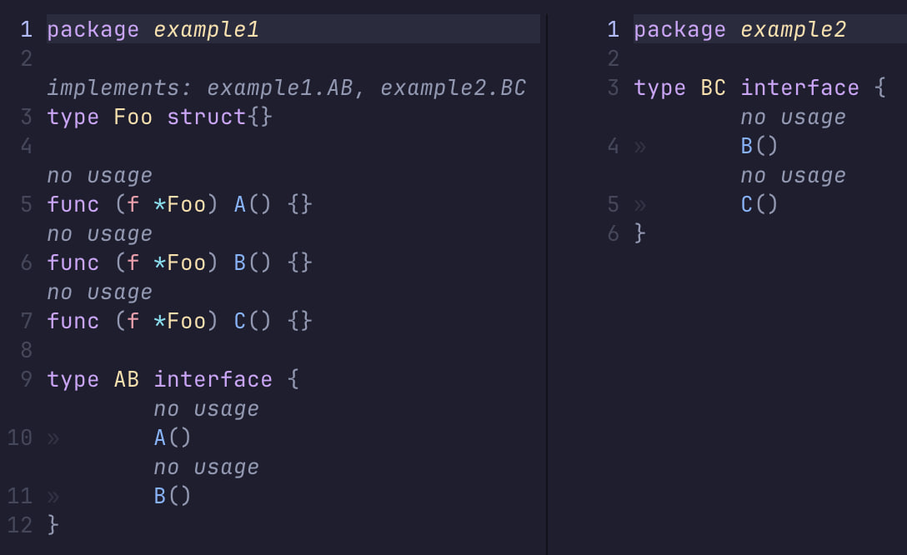

go-struct-implements
====================

Annotate Go `struct` declarations with the interfaces they implement.
Powered by gopls (LSP) and Tree‑sitter. Renders a virtual line above each struct:

  implements: io.Reader, fmt.Stringer, ...

Example
- 

Requirements
- Neovim 0.9+ (tested) with Tree‑sitter for Go
- gopls installed and configured for your workspace

Install (Lazy.nvim)
- Zero-config (auto-setup):

```lua
  { 'slvic/go-struct-implements' }
```

- Optional: disable auto-setup and configure yourself:

```lua
  {
    'slvic/go-struct-implements',
    init = function()
      vim.g.go_struct_implements_disable_auto_setup = true
    end,
    config = function()
      require('go_struct_implements').setup()
    end,
  }
```

Usage
- The plugin auto-refreshes on `BufEnter`, `BufWritePost`, and when gopls attaches.
- Manually refresh the current buffer:

```sh
:StructImplementsRefresh
```

Notes
- Large workspaces may take time; results are best‑effort from gopls.
- Only active for `filetype=go` buffers.
